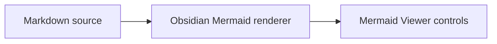

# Mermaid Viewer for Obsidian

Enhance Mermaid diagrams rendered by Obsidian with a compact, GitHub-inspired
toolbar. The plugin reuses Obsidian's built-in Mermaid renderer and only adds an
interaction layer around the generated SVG.

## Features

- Preserve Obsidian's rendered Mermaid size by default and fit down only when
  the pane is narrower
- Zoom from the fitted scale to 800%, anchored to the viewport center or pointer
  position
- Pan by dragging, toolbar direction buttons, or touch input
- Reset and fit the diagram to its viewport
- Copy the original Mermaid source from reading view
- Open the same SVG in an Obsidian fullscreen modal without cloning SVG IDs
- Follow Obsidian theme variables on desktop and mobile
- Preserve and restore Obsidian's original Mermaid DOM when the plugin unloads

## Design

The plugin deliberately does not bundle Mermaid or register another
`mermaid` code block processor. Obsidian remains responsible for parsing,
rendering, theming, and sanitizing Mermaid diagrams. A scoped Markdown post
processor waits for the rendered SVG, then adds the controls with a
`MarkdownRenderChild` so observers and event listeners follow the note render
lifecycle.

## Installation

### Development installation

Clone the repository and install dependencies:

```bash
git clone https://github.com/ives22/obsidian-mermaid-viewer.git
cd obsidian-mermaid-viewer
npm install
npm run build
```

Copy the built plugin files to your vault plugin directory:

```bash
mkdir -p /path/to/vault/.obsidian/plugins/mermaid-viewer
cp manifest.json main.js styles.css /path/to/vault/.obsidian/plugins/mermaid-viewer/
```

Reload Obsidian, then enable **Mermaid Viewer** under **Community plugins**.

### Manual installation

Copy `manifest.json`, `main.js`, and `styles.css` from a release into:

```text
<vault>/.obsidian/plugins/mermaid-viewer/
```

## Usage

Open a note containing a Mermaid code block in reading view:

````markdown

````

Use the icon toolbar to zoom, pan, reset, copy the Mermaid source, or enter
fullscreen. Hold `Ctrl` or `Cmd` while using the mouse wheel to zoom around the
pointer without taking over normal note scrolling.

## Development

```bash
npm run dev      # watch and rebuild main.js
npm test         # run unit and DOM interaction tests
npm run lint     # validate Obsidian plugin conventions
npm run build    # type-check and create the production bundle
```

## Current scope

Version `0.1.0` targets Mermaid diagrams in reading view. Live Preview support
will use a separately scoped CodeMirror integration rather than depending on a
global document observer.

## License

[MIT](LICENSE)
